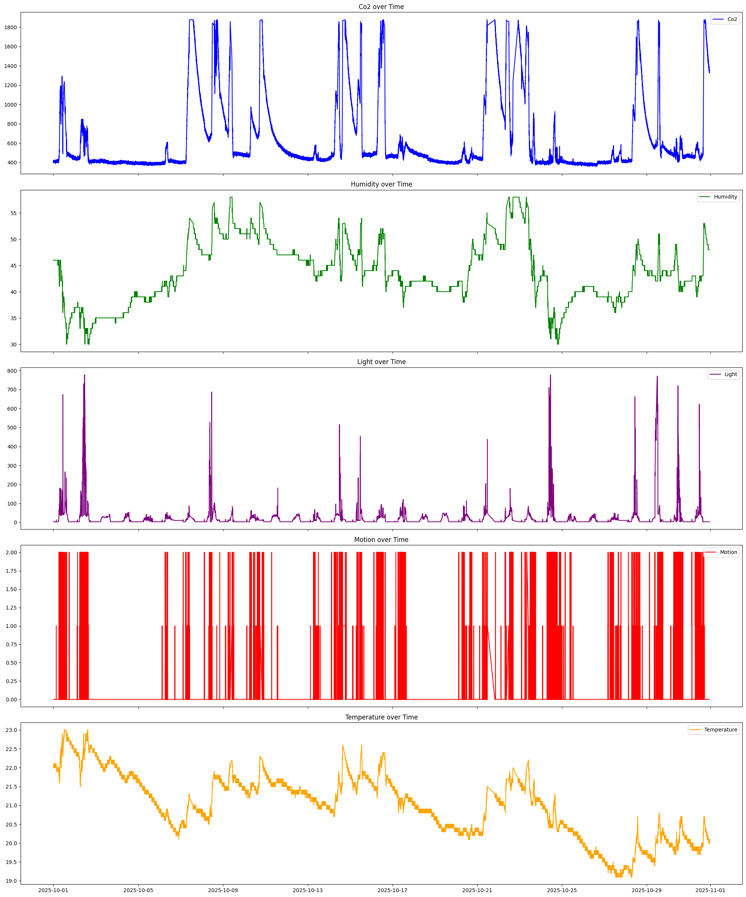
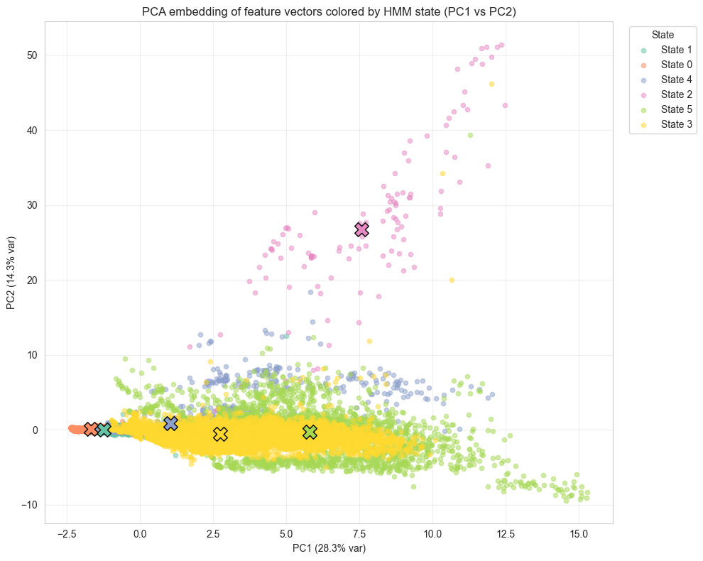
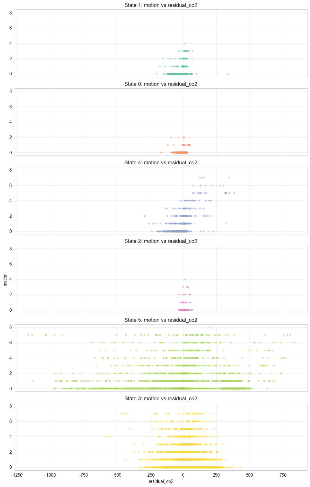
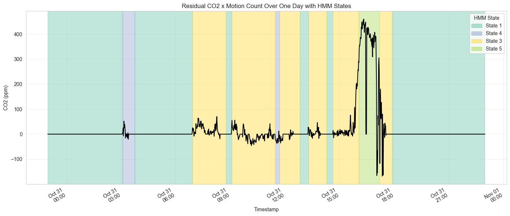
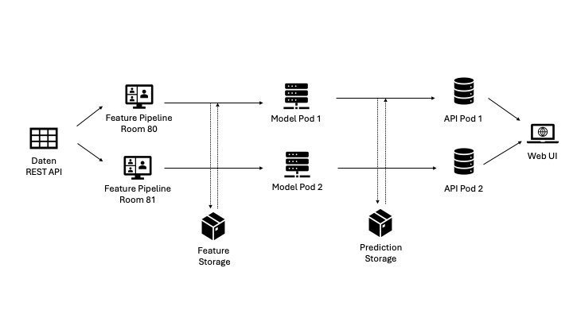

# HMM Sense OCC

## Projektübersicht

### Forschungsfrage:
Wie lässt sich die Raumbelegung durch CO2-, Bewegungs-, Licht-, Temperatur und Feuchtigkeitssensoren

### Ziel:
- Prognose der prozentualen Raumbelegung inklusiver Wahrscheinlichkeiten
- Visualisierung der Treiber
- Bereitstellung über einen Service-Endpoint

### Erfolgskriterium:
- mindestens eine binäre Klassifikation der Belegung (leer/voll) im 5 Minuten Takt
- Realistischer Mehrwert für Studierende bei der Raumsuche

## Recherche & Konzepte

### Bestehende Lösung
- [Energy and Buildings, 2015](https://doi.org/10.1016/j.enbuild.2015.11.071)
- [Indoor Occupancy Detection, 2024](https://www.researchgate.net/publication/391306996_Indoor_Occupancy_Detection_Using_Machine_Learning_and_Environmental_Sensors)

Die aufgelisteten Lösungen setzen auf gelabelte Datensätze, da unsere Sensorhistorie jedoch keine verlässlichen Labels oder Validierungsszenarien bietet, verfolgen wir einen vollständig unsupervised Ansatz.

## Datenquellen & Exploration

### HM-Sense API
- [API der Hochschule München](https://hm-sense-open-data-api.kube.cs.hm.edu/)
- Rohdaten Umweltsensoren (CO2, Bewegungs, Licht, Temperatur und Feuchtigkeit)

### Exploration
Die Datenexploration (siehe [Exploration der Daten](eda_sensor.ipynb)) fokussiert sich auf den Sensor 55 und deckt den Zeitraum 2025‑10‑01 bis 2025‑11‑01 ab. Nach Grundstatistiken und Zeitindexierung werden Ausreißer per Z‑Score entfernt, um saubere Trends für CO2, Bewegung, Licht, Temperatur und Feuchtigkeit zu erhalten. Korrelations‑Heatmaps, Histogramme und Wochen‑Slices legen typische Tagesverläufe sowie Wechselwirkungen zwischen Umweltgrößen offen, während differenzierte Reihen und Motion/CO2‑Overlays Hinweise auf potenzielle Belegungsmuster liefern.

## Modellversuch

Das Modell ist ein vollständig unsupervised Setup mit GaussianHMM. Nach Feature-Engineering werden alle Merkmale skaliert und per Grid Search die Zahl latenter Zustände bestimmt.

Die rohen Zustände werden anschließend zeitlich geglättet, nach sensorischen Profilen sortiert und interpretiert.

State-Raster, PCA Projektion, sowie CO2/Motion-Overlays zeigen, dass die Zustände robuste Tagesmuster erfassen.

## Pipeline & Service Architecture

Ein modularer Aufbau trennt Feature-Erzeugung, Modellinferenz, API-Zugriff und Persistenz, während Kafka als Event-Layer fungiert.

### Feature-Engineering-Pod
- Datenabruf (Polling Sensor API)  
- Datenbereinigung  
- Feature Engineering  
- Export der Feature-Vektoren  
- Ablage im Feature Storage

### Model-Pod
- Konsum der Feature-Vektoren (Batch oder Realtime)  
- HMM-Inferenz der Raumbelegung  
- Persistenz im Prediction Storage

### API-Pods
- Abruf der Predictions aus Storage oder Model-Pod  
- Einheitliche Schnittstelle für UI/App  
- Optional Authentifizierung und Rate-Limiting

### Storage-Pods
- Speicherung von Feature- und Prediction-Vektoren  
- Bereitstellung historischer Daten

### Kommunikation
- Eventstreaming über Kafka für lose Kopplung und Skalierung

## Ausblick

- Dashboard mit Plotly Dash/Streamlit
- Erstellen von Ground Truth Daten mit Hilfe von Stundeplänen
- Rest-Service für Echtzeit-State-Abfragen